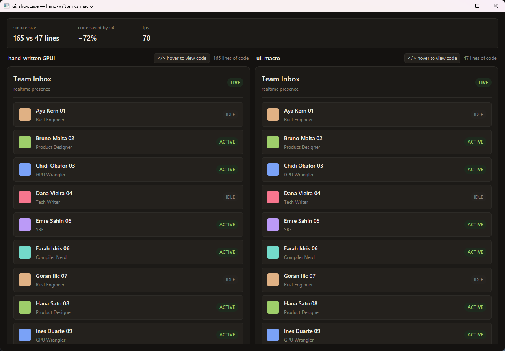
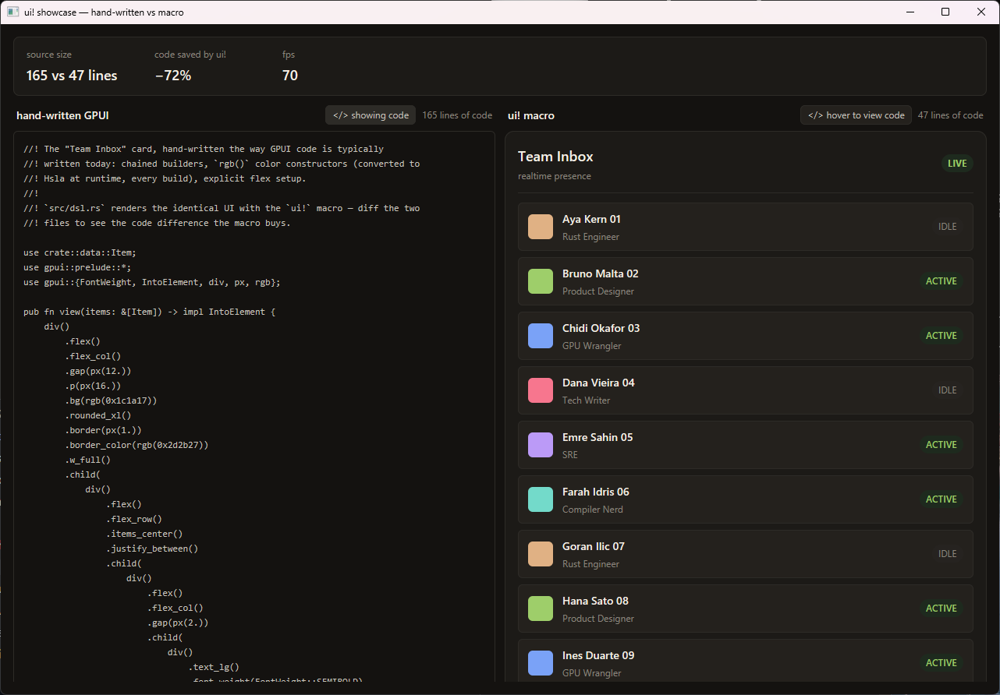

# showcase — hand-written GPUI vs `ui!`, side by side

A real GPUI window that renders the **same UI twice** — left built with
hand-written builder chains, right with the `ui!` macro — pixel-identical,
with **zero runtime overhead**. The stats bar shows the point: the same UI
in **72% less code** (165 vs 47 lines, counted live from the actual source
files).

```sh
cargo run -p declarative-gpui-examples --release
```



Hover a pane's **`</> hover to view code`** button to swap that pane's live
UI for the exact source file that renders it:



## The code difference

The two implementations live in deliberately diffable files:

| File | Implementation |
|---|---|
| [`src/hand_written.rs`](src/hand_written.rs) | idiomatic GPUI: chained builders, `rgb()` colors |
| [`src/dsl.rs`](src/dsl.rs) | identical UI via `ui!` |

Same structure, same values, same pixels — the macro expands to the same
builder calls you'd write by hand, so there is nothing extra at runtime. If
the two panes ever render differently, that's a macro bug (file it!).
